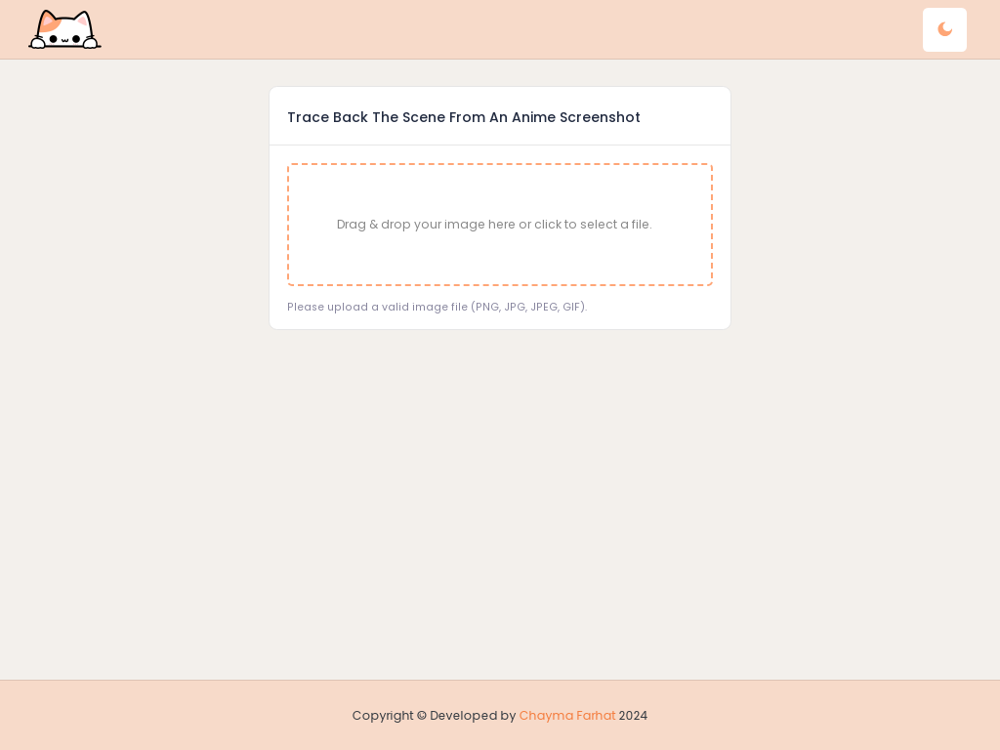

# Anime Detector

Welcome to **Anime Detector**! This web application allows anime fans to trace back scenes from their favorite anime using screenshots through the **Trace.moe API**. It's perfect for anyone wanting to discover more about specific anime moments easily.

----

<p align="center">
  <a href="https://animedetector.netlify.app/"><strong>Demo</strong></a>
</p>



## Features

- 📷 **Search by Image:** Upload an anime screenshot to find corresponding scene information.
- ✂️ **Cut Black Borders:** Improve search accuracy by removing black borders from images.
- ℹ️ **Include Anilist Info:** Get additional information from Anilist for a richer experience.

----

## Quick Start

Follow these steps to set up Anime Detector locally:

1. **Clone the Repository**:
   ```bash
   git clone https://github.com/h-chayma/anime-detector.git
   cd anime-detector
   ```

2. **Install Dependencies**:
   ```bash
   npm install
   ```

3. **Start the Application**:
   ```bash
   ng serve
   ```

   This will start the application on `http://localhost:4200`.

----

## Usage

To use the Anime Detector, simply upload an anime screenshot and hit the search button. The app will process the image and return relevant scene details, including the title, episode, and more.

----

## Acknowledgements

Anime Detector utilizes the **Trace.moe API** for scene recognition, enabling users to easily trace anime scenes from images.

----

## Contributing

Contributions are welcome! If you’d like to contribute to Anime Detector, please fork the repository and submit a pull request. Feel free to open issues for any bug reports or feature requests.

## License

This project is licensed under the [MIT License](LICENSE). You are free to use, modify, and distribute this software in accordance with the license.